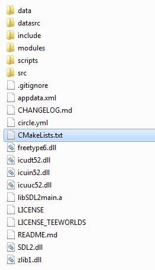
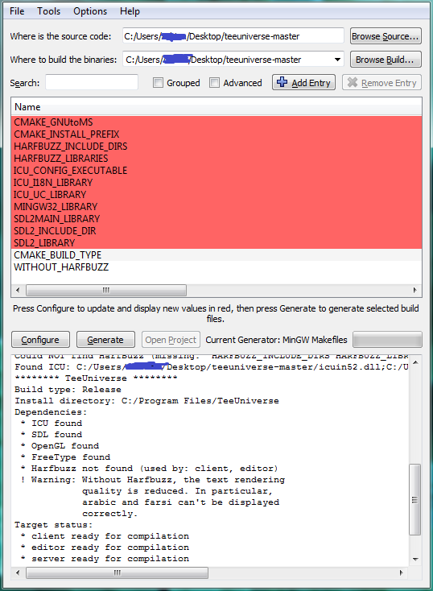

#TeeUniverse [](https://circleci.com/gh/teeuniverse/teeuniverse)

TeeUniverse is a free and open-source game offering powerful and robust support for playing online various gamemodes and playgrounds.


##Required Libraries and Programs

TeeUniverse, like TeeWorlds, needs SDL2, OpenGL, libpng and freetype.
The libraries ICU and Harfbuzz must be also installed.
Please make sure that CMake is install too, because the compilation process relies on it.


##Compilation (Linux)

Download the sources using github:
```
git clone https://github.com/teeuniverse/teeuniverse.git
cd teeuniverse
```

Compile the project:
```
cmake -DCMAKE_BUILD_TYPE=Release .
make
sudo make install
```

Execute the TeeUniverse editor:
```
teeuniverse_editor
```

##Compilation (Windows, MinGW)

###CMake

Download CMake from its official webpage. If you are using Windows 32-bit, [download this installer (official download page)](https://cmake.org/files/v3.7/cmake-3.7.1-win32-x86.msi). If you are using Windows 64-bit, [download this installer (official download page)](https://cmake.org/files/v3.7/cmake-3.7.1-win64-x64.msi)

Execute the downloaded MSI file and install CMake. Defaults options are fine.

###TeeUniverse

Download the sources from [GitHub (ZIP file)](https://github.com/teeuniverse/teeuniverse/archive/master.zip) and extract the content of this archive in your computer. We will refer to this extracted directory as "TeeUniverse directory"

Download all needed libraries and sources from [the official website of TeeUniverse (ZIP file)](http://teeuniverse.net/data/teeuniverse-windows-libs.zip), and extract the content of this archive in the TeeUniverse directory.

Your TeeUniverse directory should look like this:



###Generate the Makefile

Execute CMake (cmake-gui).

Click on "Browse Source..." and select the TeeUniverse directory.

Click on "Browse Build..." and select the TeeUniverse directory.

Click on "Add Entry", fill the "Name" field with "CMAKE_BUILD_TYPE", the "Type" field with "STRING" and the "Value" field with "Release". Click on "OK"

Click on "Add Entry" again, fill the "Name" field with "WITHOUT_HARFBUZZ", the "Type" field with "BOOL", keep the "Value" field empty. Click on "OK"

Click on "Configure". check that "MinGW Makefiles" is selected and click on "Finish". Other generators maybe be possible to use, but has not been tested yet.

Click on "Generate".

Your CMake Window should look like this:



You can now close CMake.

###Compilation

Execute MinGW Command Prompt and type the following command to go in the TeeUniverse directory (please replace "C:\path\to\teeuniverse\directory" by your actual path to the TeeUniverse directory):
```
cd C:\path\to\teeuniverse\directory
```

Type the following command to compile TeeUniverse in 32-bit (TeeUniverse may be compatible with 64-bit compilation but was never tested. Please use this command even if you are using Windows 64-bit):
```
mingw32-make
```

Type the following command to execute TeeUniverse editor:
```
bin\release\teeuniverse_editor.exe
```
